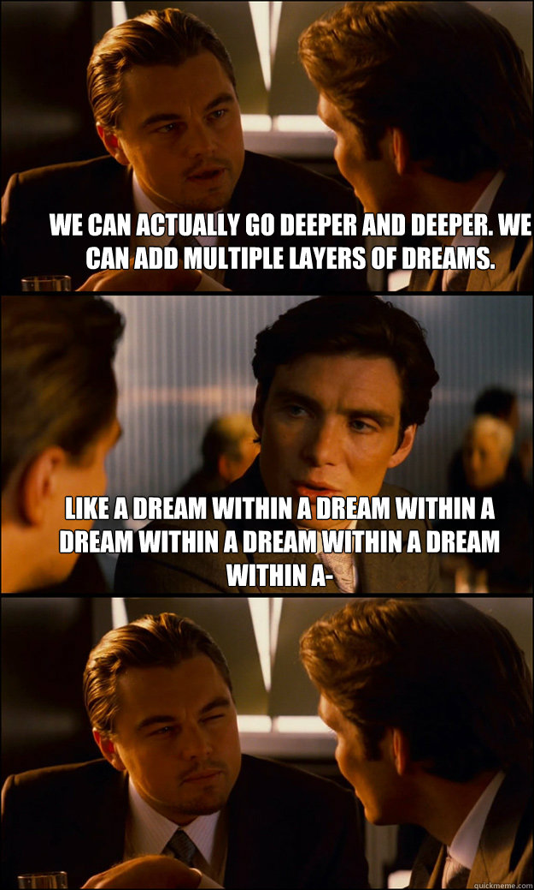

# What is a decorator?

A **decorator** is a function, that takes a function as an input, and returns a function in its place. It is said that the decorator function or the function it returns ***decorates*** the input function.

This works because functions are **first class** in Python, meaning they can be given as input and returned as output from another function.

```python
my_impressive_function()  # <-- Makes a call to the function and refers to the returned result.
my_impressive_function  # <-- Refers to the function itself.
```

## Anatomy of a Decorator

```python
from functools import wraps
from typing import ParamSpec, TypeVar

P, T = ParamSpec('P'), TypeVar('T')

def decorator(func: Callable[P, T]) -> Callable[P, T]:
    """Decorates a function."""
    
    @wraps(func)  # Make decorated_func look like func.
    def decorated_func(*args: P.args, **kwargs: P.kwargs) -> T:
        """Decorated function call."""
        # ...
        result = func(*args, **kwargs)
        # ...
        return result
    
    return decorated_func  # Return that decorated function.

```



## Decorator Syntax

This...

```python
@silence_exceptions  # <--- Sweet, beautiful syntactic sugar
def my_activity():
    ...
```

Is the same as...

```python
my_activity = silence_exceptions(my_activity)
```

## Decorators in the standard library


| Name                        | What it does                                                                     |
| --------------------------- | -------------------------------------------------------------------------------- |
| `classmethod`               | Turns an instance method into a class method.                                    |
| `property`                  | Turns the wrapped function into a descriptor.                                    |
| `contextlib.contextmanager` | Turns a function with a single `yield` statement into a context manager.         |
| `dataclasses.dataclass`     | Generates boilerplate methods for classes with annotated class-level attributes. |
| `functools.lru_cache`       | Memoizes outputs based on their input arguments.                                 |
| `functools.wraps`           | Makes the decorated function appear like another function.                       |

## Conventions used in this document

| Name                   | Meaning                                                                          |
| ---------------------- | -------------------------------------------------------------------------------- |
| "wrapped", "decorated" | I will use these terms interchangeably, but they mean the same thing.            |
| `func`, `wfunc`        | The input function.                                                              |
| `wrapper`              | A function that decorates or wraps another function.                             |
| `wrapped`              | The wrapped function call to `func`/`wfunc` that is being returned in its place. |
| `wraps`                | The `functools.wraps` decorator.                                                 |
